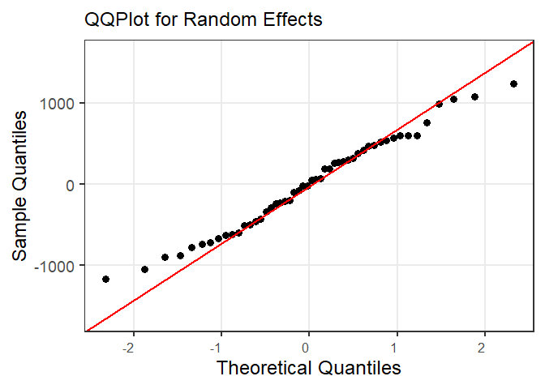
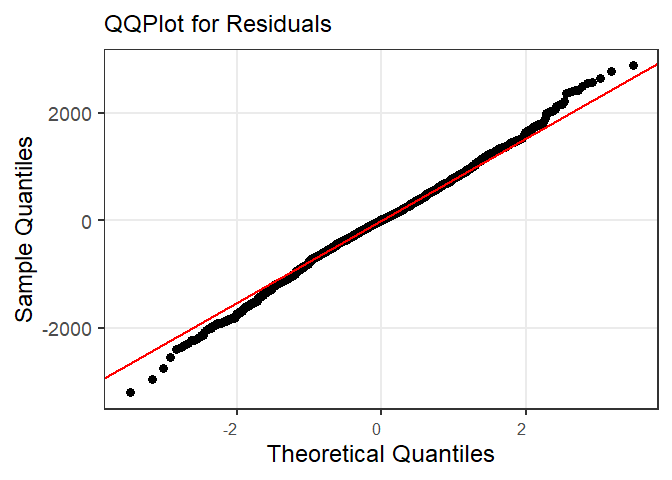

<!-- README.md is generated from README.Rmd. Please edit that file -->

# MEGB

<!-- badges: start -->

<!-- badges: end -->

enables users to make unit-level as well as area-level estimates for
hierarchical data in the context of Small Area Estimation

## Installation

You can install MEGB from Github with:

``` r
# install.packages("devtools")
devtools::install_github("pellmess/MEGB")
#> Using GitHub PAT from the git credential store.
#> Downloading GitHub repo pellmess/MEGB@HEAD
#> RcppArmad... (15.2.2-1 -> 15.2.3-1) [CRAN]
#> timeDate     (4041.110 -> 4051.111) [CRAN]
#> rbibutils    (2.3      -> 2.4     ) [CRAN]
#> doBy         (4.7.0    -> 4.7.1   ) [CRAN]
#> reformulas   (0.4.1    -> 0.4.3   ) [CRAN]
#> lme4         (1.1-37   -> 1.1-38  ) [CRAN]
#> stringr      (1.5.2    -> 1.6.0   ) [CRAN]
#> broom        (1.0.10   -> 1.0.11  ) [CRAN]
#> S7           (0.2.0    -> 0.2.1   ) [CRAN]
#> isoband      (0.2.7    -> 0.3.0   ) [CRAN]
#> purrr        (1.1.0    -> 1.2.0   ) [CRAN]
#> tidyr        (1.3.1    -> 1.3.2   ) [CRAN]
#> ggsci        (4.1.0    -> 4.2.0   ) [CRAN]
#> ggplot2      (4.0.0    -> 4.0.1   ) [CRAN]
#> parallelly   (1.45.1   -> 1.46.0  ) [CRAN]
#> listenv      (0.9.1    -> 0.10.0  ) [CRAN]
#> digest       (0.6.37   -> 0.6.39  ) [CRAN]
#> dbscan       (1.2.3    -> 1.2.4   ) [CRAN]
#> data.table   (1.17.8   -> 1.18.0  ) [CRAN]
#> future       (1.67.0   -> 1.68.0  ) [CRAN]
#> xgboost      (1.7.11.1 -> 3.1.2.1 ) [CRAN]
#> Installing 21 packages: RcppArmadillo, timeDate, rbibutils, doBy, reformulas, lme4, stringr, broom, S7, isoband, purrr, tidyr, ggsci, ggplot2, parallelly, listenv, digest, dbscan, data.table, future, xgboost
#> Installiere Pakete nach 'C:/Users/paulm/AppData/Local/Temp/Rtmp6B3wHy/temp_libpath120c0307a1ffa'
#> (da 'lib' nicht spezifiziert)
#> Paket 'RcppArmadillo' erfolgreich ausgepackt und MD5 Summen abgeglichen
#> Paket 'timeDate' erfolgreich ausgepackt und MD5 Summen abgeglichen
#> Paket 'rbibutils' erfolgreich ausgepackt und MD5 Summen abgeglichen
#> Paket 'doBy' erfolgreich ausgepackt und MD5 Summen abgeglichen
#> Paket 'reformulas' erfolgreich ausgepackt und MD5 Summen abgeglichen
#> Paket 'lme4' erfolgreich ausgepackt und MD5 Summen abgeglichen
#> Paket 'stringr' erfolgreich ausgepackt und MD5 Summen abgeglichen
#> Paket 'broom' erfolgreich ausgepackt und MD5 Summen abgeglichen
#> Paket 'S7' erfolgreich ausgepackt und MD5 Summen abgeglichen
#> Paket 'isoband' erfolgreich ausgepackt und MD5 Summen abgeglichen
#> Paket 'purrr' erfolgreich ausgepackt und MD5 Summen abgeglichen
#> Paket 'tidyr' erfolgreich ausgepackt und MD5 Summen abgeglichen
#> Paket 'ggsci' erfolgreich ausgepackt und MD5 Summen abgeglichen
#> Paket 'ggplot2' erfolgreich ausgepackt und MD5 Summen abgeglichen
#> Paket 'parallelly' erfolgreich ausgepackt und MD5 Summen abgeglichen
#> Paket 'listenv' erfolgreich ausgepackt und MD5 Summen abgeglichen
#> Paket 'digest' erfolgreich ausgepackt und MD5 Summen abgeglichen
#> Paket 'dbscan' erfolgreich ausgepackt und MD5 Summen abgeglichen
#> Paket 'data.table' erfolgreich ausgepackt und MD5 Summen abgeglichen
#> Paket 'future' erfolgreich ausgepackt und MD5 Summen abgeglichen
#> Paket 'xgboost' erfolgreich ausgepackt und MD5 Summen abgeglichen
#> 
#> Die heruntergeladenen Binärpakete sind in 
#>  C:\Users\paulm\AppData\Local\Temp\RtmpWw5yRb\downloaded_packages
#> Downloading package from url: https://github.com/catboost/catboost/releases/download/v1.2.8/catboost-R-Windows-1.2.8.tgz
#> 
#> ── R CMD build ─────────────────────────────────────────────────────────────────
#>       ✔  checking for file 'C:\Users\paulm\AppData\Local\Temp\RtmpWw5yRb\remotese3785d42cb1\catboost/DESCRIPTION'
#>       ─  preparing 'catboost': (747ms)
#>    checking DESCRIPTION meta-information ...  ✔  checking DESCRIPTION meta-information
#>       ─  checking for LF line-endings in source and make files and shell scripts
#>       ─  checking for empty or unneeded directories
#>       ─  building 'catboost_1.2.8.tar.gz'
#>      
#> 
#> Installiere Paket nach 'C:/Users/paulm/AppData/Local/Temp/Rtmp6B3wHy/temp_libpath120c0307a1ffa'
#> (da 'lib' nicht spezifiziert)
#> ── R CMD build ─────────────────────────────────────────────────────────────────
#>          checking for file 'C:\Users\paulm\AppData\Local\Temp\RtmpWw5yRb\remotese37876106b38\pellmess-MEGB-fef3a1e/DESCRIPTION' ...  ✔  checking for file 'C:\Users\paulm\AppData\Local\Temp\RtmpWw5yRb\remotese37876106b38\pellmess-MEGB-fef3a1e/DESCRIPTION'
#>       ─  preparing 'MEGB':
#>    checking DESCRIPTION meta-information ...     checking DESCRIPTION meta-information ...   ✔  checking DESCRIPTION meta-information
#>       ─  checking for LF line-endings in source and make files and shell scripts
#>       ─  checking for empty or unneeded directories
#>      NB: this package now depends on R (>=        NB: this package now depends on R (>= 4.1.0)
#>      WARNING: Added dependency on R >= 4.1.0 because package code uses the
#>      pipe |> or function shorthand \(...) syntax added in R 4.1.0.
#>      File(s) using such syntax:
#>        'mse_megb.R'
#>   ─  building 'MEGB_0.0.0.9000.tar.gz'
#>      
#> 
#> Installiere Paket nach 'C:/Users/paulm/AppData/Local/Temp/Rtmp6B3wHy/temp_libpath120c0307a1ffa'
#> (da 'lib' nicht spezifiziert)
```

## Usage

To understand how to use MEGB:

``` r
library(MEGB)
#> Warning: vorhergehender Import 'magrittr::set_names' durch 'purrr::set_names'
#> während des Ladens von 'MEGB' ersetzt
#> Warning: vorhergehender Import 'dplyr::lag' durch 'stats::lag' während des
#> Ladens von 'MEGB' ersetzt
#> Warning: vorhergehender Import 'dplyr::filter' durch 'stats::filter' während
#> des Ladens von 'MEGB' ersetzt

# Loading data - population and sample data
data("population_data")
data("sample_data")

# Example with MSE = TRUE

# creates object of class MEGB, which includes point estimates as well as 
# uncertainty estimates

result <- megb(Y = sample_data$y,
               X = sample_data[, 2:6],
               dom_name = "domain",
               smp_data = sample_data,
               pop_data = population_data,
               na.rm = TRUE,
               seed = 1,
               mse = TRUE,
               B = 2,
               bootstrap_cores = 0,
               gbm_engine = "lightgbm"
               )
#> gradient_params is NULL — default parameters are used for the specified gbm_engine.
#> Warning in input_checks_megb(Y = Y, X = X, dom_name = dom_name, smp_data =
#> smp_data, : Using XGBoost/LightGBM: applying one-hot encoding for categorical
#> features
#> Bootstrap with 2 iterations has started
#> ■■■■■■■■■■■■■■■■ 50% | ETA: 2m

result
#> ________________________________________________________________
#> Mixed Effects Gradient Boosting (MEGB) Model
#> ________________________________________________________________
#> 
#> Model Call:
#> megb(Y = sample_data$y, X = sample_data[, 2:6], dom_name = "domain", 
#>     smp_data = sample_data, pop_data = population_data, na.rm = TRUE, 
#>     seed = 1, mse = TRUE, B = 2, bootstrap_cores = 0, gbm_engine = "lightgbm")
#> 
#> Model Summary:
#> Number of Covariates (Fixed Effects): 0 |
#>  Number of Random Effects (Domains): 50 |
#>  Number of EM Iterations Used: 3
#> 
#> Unit-Level Residual Diagnostics:
#> Residual Standard Deviation:  669.863 
#> Residual Summary:
#>      Min.   1st Qu.    Median      Mean   3rd Qu.      Max. 
#> -7334.554  -358.591    -4.715     0.000   366.815  5040.666 
#> 
#> Estimated Root Mean Squared Error (RMSE) Summary:
#>    Min. 1st Qu.  Median    Mean 3rd Qu.    Max. 
#>   86.32  465.20  610.98  623.77  844.70 1440.17 
#> 
#> Boosting Information:
```

The package also includes a plot method:

    #> Warning in plot.MEGB(result): Boosting-related plots are only available for
    #> xgboost. For catboost or lightgbm, please access boosting information via
    #> `megb_object$megb_model$boosting`.



    #> Press ENTER to continue...



    #> Press ENTER to continue...
