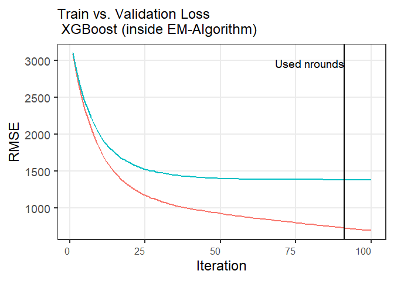
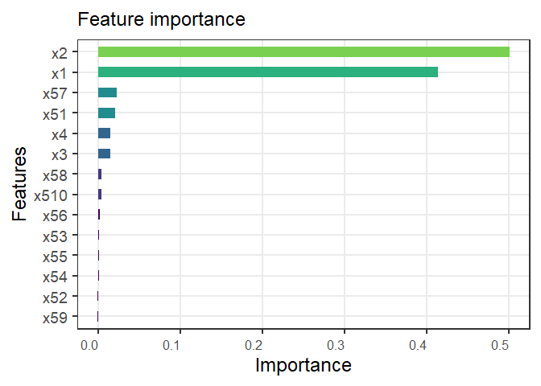

<!-- README.md is generated from README.Rmd. Please edit that file -->

# MEGB

<!-- badges: start -->

<!-- badges: end -->

enables users to make unit-level as well as area-level estimates for
hierarchical data in the context of Small Area Estimation

## Installation

You can install MEGB from Github with:

``` r
# install.packages("devtools")
devtools::install_github("pellmess/MEGB")
```

## Usage

To understand how to use MEGB:

``` r
library(MEGB)

# Loading data - population and sample data
data("population_data")
data("sample_data")

# Example with MSE = TRUE

params <- list(eta = 0.1,      # learning rate
               nrounds = 100   # number of iterations
               )

# creates object of class MEGB, which includes point estimates as well as 
# uncertainty estimates

result <- megb(Y = sample_data$y,
               X = sample_data[, 2:6],
               dom_name = "domain",
               smp_data = sample_data,
               pop_data = population_data,
               gradient_params = params,
               na.rm = TRUE,
               seed = 1,
               mse = TRUE,
               B = 2,
               bootstrap_cores = 0,
               gbm_engine = "xgboost"
               )

result
#> ________________________________________________________________
#> Mixed Effects Gradient Boosting (MEGB) Model
#> ________________________________________________________________
#> 
#> Model Call:
#> megb(Y = sample_data$y, X = sample_data[, 2:6], dom_name = "domain", 
#>     smp_data = sample_data, pop_data = population_data, gradient_params = params, 
#>     na.rm = TRUE, seed = 1, mse = TRUE, B = 2, bootstrap_cores = 0, 
#>     gbm_engine = "xgboost")
#> 
#> Model Summary:
#> Number of Covariates (Fixed Effects): 0 |
#>  Number of Random Effects (Domains): 50 |
#>  Number of EM Iterations Used: 10
#> 
#> Unit-Level Residual Diagnostics:
#> Residual Standard Deviation:  818.062 
#> Residual Summary:
#>     Min.  1st Qu.   Median     Mean  3rd Qu.     Max. 
#> -3200.02  -504.13    11.77     0.00   527.92  2876.75 
#> 
#> Estimated Root Mean Squared Error (RMSE) Summary:
#>    Min. 1st Qu.  Median    Mean 3rd Qu.    Max. 
#>    78.6   509.2   716.2   717.6   946.2  1263.5 
#> 
#> Boosting Information:
#> Number of Boosting Iterations: 91
```

The package also includes a plot method:


